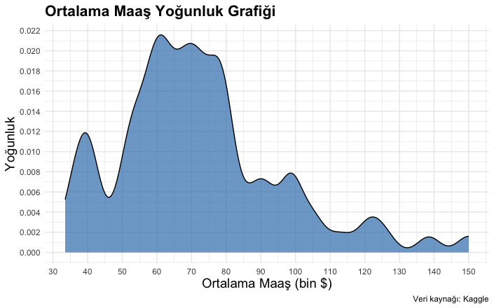
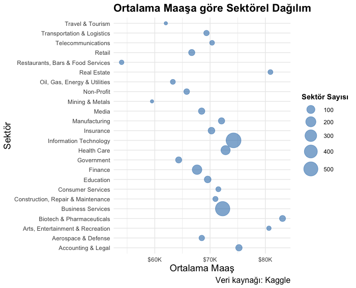
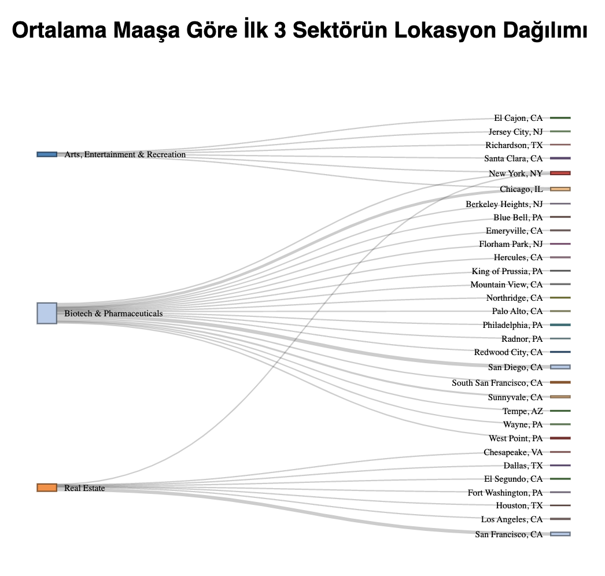

# Data Analyst Average Salary Analysis

## Overview

This repository contains the R script used to analyze and visualize a dataset of average salaries for data analyst positions. The dataset is sourced from Kaggle and the analysis involves data cleaning, transformation, and various visualizations.

## Dataset

The dataset used in this analysis can be found at the following link:
[Data Analyst Salary Dataset](https://raw.githubusercontent.com/aysemuu/data-analyst-avg-salary/main/DataAnalyst.csv)

## Steps in the Analysis

1. **Loading the Dataset**
    - The dataset is read into an R dataframe and checked for missing values and incorrect entries.

2. **Data Cleaning**
    - All `-1` values are replaced with `NA`.
    - Missing values are imputed using mean for numeric columns.
    - Columns with a high percentage of missing values are removed.
    - Non-numeric characters are removed from the `Salary Estimate` column and average salary values are calculated.

3. **Data Visualization**
    - **Kernel Density Plot**: Visualizes the distribution of average salaries.
    - **Bubble Chart**: Shows the average salary distribution by sector.
    - **Sankey Diagram**: Displays the relationship between sectors and locations for the top 3 sectors with the highest average salaries.

4. **Export for Tableau**
    - Summary data is prepared and exported for further visualization in Tableau.

## Visualizations

### Kernel Density Plot
The kernel density plot illustrates the distribution of average salaries in the dataset.



### Bubble Chart
The bubble chart shows the average salary distribution by sector with bubble size representing the number of job postings in each sector.



### Sankey Diagram
The Sankey diagram visualizes the flow of average salaries from the top 3 sectors to various locations.



## Export Data for Tableau

Summary data is prepared for further visualization in Tableau. The prepared data can be found at the following link:
[Tableau Map Data](https://raw.githubusercontent.com/aysemuu/data-analyst-avg-salary/main/tableau_map.csv)

# Installation and Usage

1. Clone the repository:

```
git clone https://github.com/aysemuu/data-analyst-avg-salary.git
```

2. Open the R script `data_analyst_avg_salary.R` in your R environment (i.e., R Studio).

3. Update the following section according to your path.

```
write.csv(data_summary, "path/tableau_map.csv")
```

## Dependencies

- R
- ggplot2
- dplyr
- scales
- networkD3

You can install the required R packages using the following commands:

```
install.packages("ggplot2")
install.packages("dplyr")
install.packages("scales")
install.packages("networkD3")
```

# Results

The results of this analysis are available in the following formats:

- Tableau Visualization: [Tableau Dashboard](https://public.tableau.com/views/Book1_17158500010980/Dashboard2?:language=en-US&:sid=&:display_count=n&:origin=viz_share_link)
- Poster PDF: [Poster PDF](poster.pdf)

# Acknowledgments

The dataset used in this analysis is sourced from Kaggle.